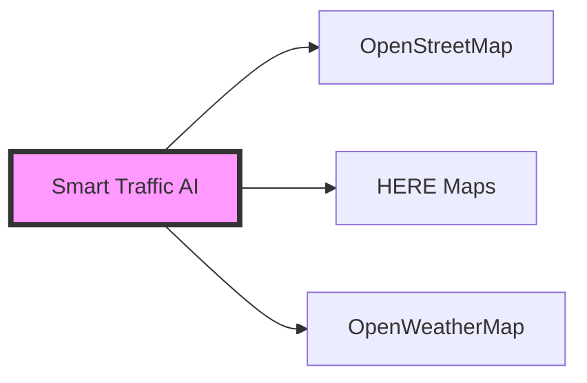

# 🚦 Smart Traffic AI


## 🎯 Proje Hakkında

Smart Traffic AI, yapay zeka ve gerçek zamanlı veri analizi kullanarak trafik akışını optimize etmeyi amaçlayan yenilikçi bir projedir. Sistem, çeşitli veri kaynaklarını kullanarak trafik yoğunluğunu tahmin eder ve sürücülere optimum rotalar önerir.

### 🌟 Temel Özellikler

| Özellik | Açıklama |
|---------|-----------|
| 📊 Gerçek Zamanlı Analiz | OpenStreetMap ve HERE Maps API entegrasyonu ile anlık trafik verisi |
| 🤖 AI Tahminleri | TensorFlow Lite tabanlı trafik yoğunluğu tahminleri |
| 🗺️ İnteraktif Harita | Kullanıcı dostu harita arayüzü ve rota görselleştirme |
| 🌤️ Hava Durumu Entegrasyonu | OpenWeatherMap ile hava koşulları analizi |
| 📱 Mobil Uyumluluk | Responsive tasarım ile her cihazda kusursuz deneyim |

## 💻 Teknolojiler

### Backend Teknolojileri
```python
{
    "ana_framework": "FastAPI",
    "veritabanı": "PostgreSQL",
    "cache": "Redis",
    "AI/ML": ["TensorFlow Lite", "Scikit-learn"]
}
```

### Frontend Teknolojileri
```javascript
{
    "framework": "Next.js",
    "harita": "OpenStreetMap + Leaflet",
    "UI": "TailwindCSS",
    "state": "React Query"
}
```

### Harici Servisler

