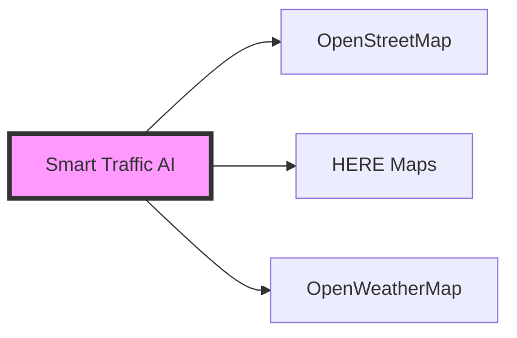

# Smart Traffic AI


## About the Project

Smart Traffic AI is an innovative project that aims to optimize traffic flow using artificial intelligence and real-time data analysis. The system predicts traffic density using various data sources and recommends optimal routes to drivers.

### Key Features

| Feature | Description |
|---------|-----------|
| Real-Time Analysis | Instant traffic data via OpenStreetMap and HERE Maps API integration |
| AI Predictions | Traffic density predictions based on TensorFlow Lite |
| Interactive Map | User-friendly map interface and route visualization |
| Weather Integration | Weather analysis with OpenWeatherMap |
| Mobile Compatibility | Seamless experience on any device with responsive design |

## Technologies

### Backend Technologies
```python
{
    “main_framework”: “FastAPI”,
    “database”: “PostgreSQL”,
    “cache”: “Redis”,
    “AI/ML”: [“TensorFlow Lite”, “Scikit-learn”]
}
```

### Frontend Technologies
```javascript
{
    “framework”: “Next.js”,
    “map”: “OpenStreetMap + Leaflet”,
    “UI”: “TailwindCSS”,
    “state”: “React Query”
}
```

### External Services

